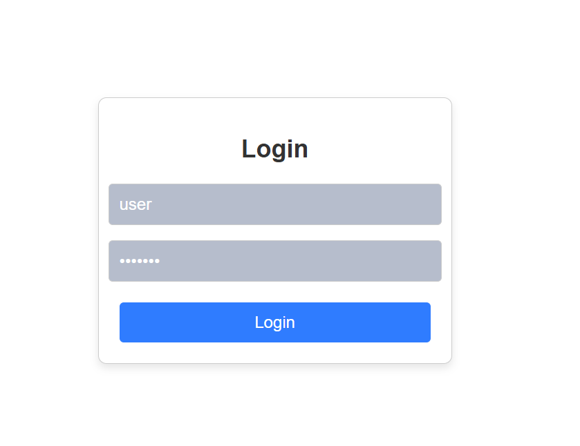
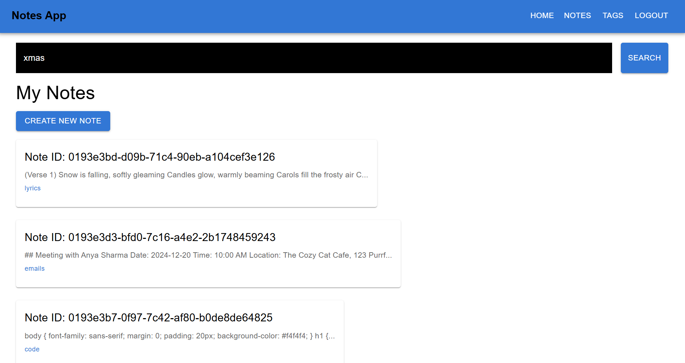
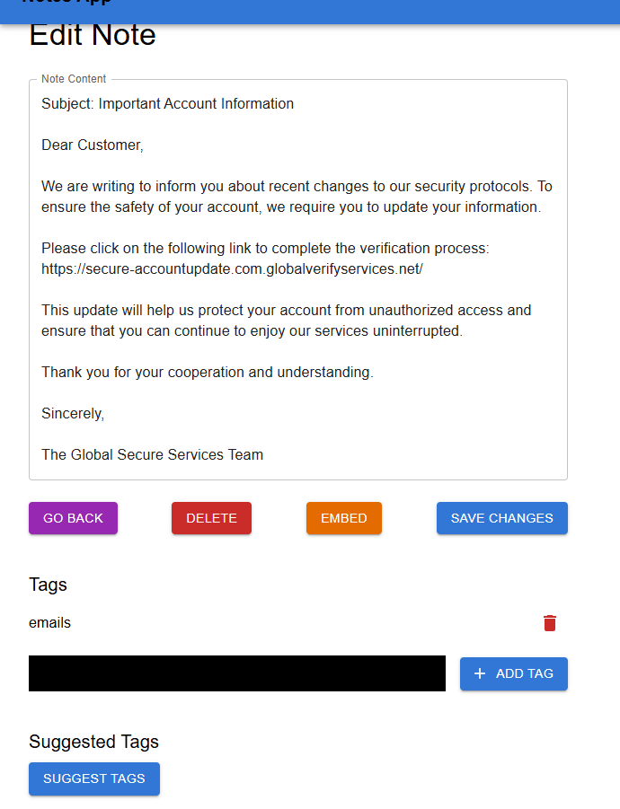
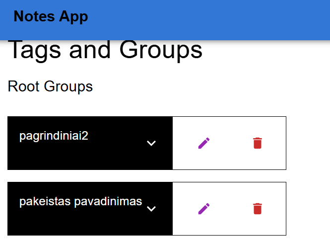
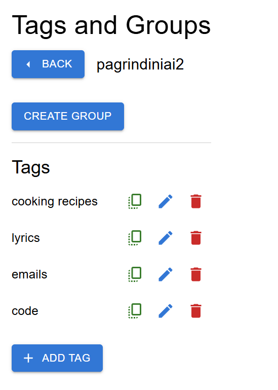
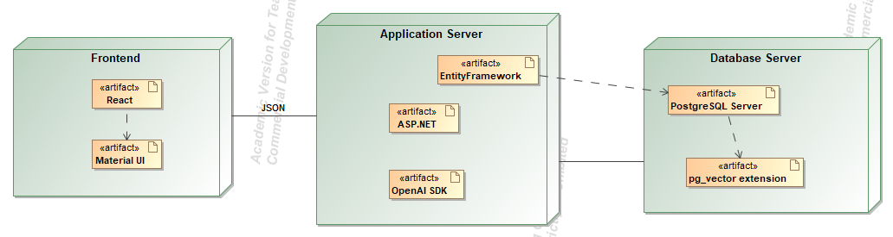

# Užrašų Valdymo Sistema

## Sistemos aprašymas

Ši sistema suteikia galimybę naudotojams įkelti užrašus ir padeda juos efektyviai grupuoti. Sistema siūlo žymes, atitinkančias įkelto užrašo turinį, taip palengvindama užrašų organizavimą ir paiešką.

## Funkciniai reikalavimai

### Svečiai

- **Narių lyderių lentelės peržiūra**
  - Matoma narių priimtų užrašų lyderių lentelę
- **Registracija**
  - Registruojantis į sistemą, į nurodytą el. pašto adresą išsiunčiamas registracijos patvirtinimas.

### Naudotojai ir administratoriai

- **Prisijungimas**
  - Prisijungus su registruota naudotojo paskyra, serveris išduoda JWT žetoną, skirtą autentifikacijai.
- **Atsijungimas**
  - Atsijungiant, serveris anuliuoja dabartinio JWT žetono galiojimą.
- **Slaptažodžio atstatymas**
  - Į nurodytą el. pašto adresą išsiunčiamas slaptažodžio atstatymo laiškas.
- **Paskyros naikinimas**
  - Naudotojai gali pašalinti savo paskyrą ir visą su ja susijusią informaciją.

### Naudotojai

- **Asmeninės žymės**
  - Galimybė kurti asmenines žymes, kurių nėra viešame sąraše.
  - Galimybė grupuoti žymes patogesniam organizavimui.
- **Užrašų įkėlimas**
  - Įkėlus užrašą, sistema analizuoja turinio prasmę, išreikštą vektoriniu atvaizdžiu.
  - Palygina gautą vektorinį atvaizdį su žymių vektoriniais atvaizdžiais ir siūlo penkias artimiausias žymes.
  - Leidžia pridėti žymes iš siūlomų, viešų ir asmeninių žymių sąrašų.
  - Leidžia pašalinti pasirinktas žymes.
- **Užrašų peržiūra**
  - Galimybė pasiūlyti užrašo turinį sistemos tikslumo tobulinimui.
  - Jei užrašas pasiūlytas, rodoma jo būsena ir administratoriaus komentarai.
- **Užrašų paieška**
  - Galimybė filtruoti asmeninius užrašus pagal žymes.
  - Galimybė ieškoti užrašų pagal vektorinį atvaizdį.
- **Užrašų naikinimas**
  - Leidžia pašalinti užrašą. Jei užrašas buvo pasiūlytas sistemos tobulinimui, perskaičiuojamos naudotų viešų žymių vektorinių atvaizdžių reikšmės.

### Administratoriai

- **Naudotojų paskyrų valdymas**
  - Galimybė panaikinti naudotojų paskyras.
  - Galimybė laikinai uždrausti naudotojų paskyras.
  - Galimybė peržiūrėti naudotojų užrašus ir asmenines žymes.
- **Pasiūlytų užrašų peržiūra**
  - Galimybė priimti naudotojų pasiūlytus užrašus kaip tinkamus.
- **Viešos žymės**
  - Galimybė kurti naujas žymes ir jų grupes.
  - Galimybė šalinti žymes.

## Pasirinktų technologijų aprašymas

**Programavimo kalbos:**

- **C#**
  - Naudojama backend sistemos daliai sukurti, naudojant **ASP.NET** karkasą.
- **TypeScript**
  - Naudojama frontend kūrimui su **React** biblioteka, suteikiant tipų patikrinimą ir geresnę kodo struktūrą.
- **HTML**
  - Naudojama tinklalapių struktūrai apibrėžti ir turiniui pateikti.
- **SQL**
  - Naudojama duomenų bazės užklausoms su **PostgreSQL** duomenų baze.

**Technologijos:**

- **Docker**
- **React**
- **ASP.NET**
- **PostgreSQL**

**[Nuoroda](./swagger.json) į OpenAPI**:

## Langai:
Prisijungimo langas:

Užrašų sąrašas:

Užrašo peržiūra:

Žymių grupių sąrašas:

Žymių sąrašas grupėje:

## UML deployment diagrama:

## Išvados
- Plėtinys [pg_vector](https://github.com/pgvector/pgvector) ir biblioteka [Pgvector.EntityFrameworkCore](https://github.com/pgvector/pgvector-dotnet) leidžia lengvai saugoti ir lyginti vektorinius atvaizdžius.
- Vektorinis matmuo nėra nustatyas, todėl galima pakeisti naudojamą modelį nekeičiant duomenų bazės struktūros. Dabartinis modelis: [text-embedding-3-small](https://openai.com/index/new-embedding-models-and-api-updates/).
- Žymių pasiūlymų tikslumas priklauso nuo esamų duomenų kiekio.
- Žymių grupės palengvina žymių organizavimą.